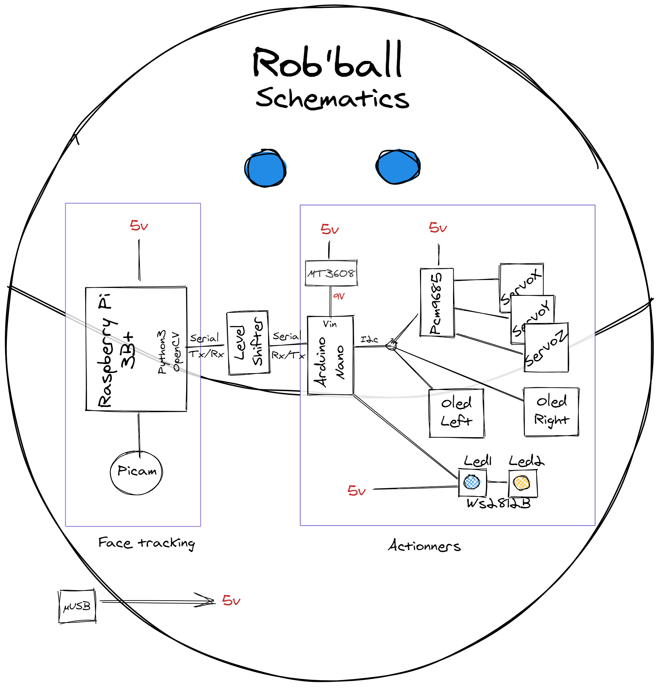
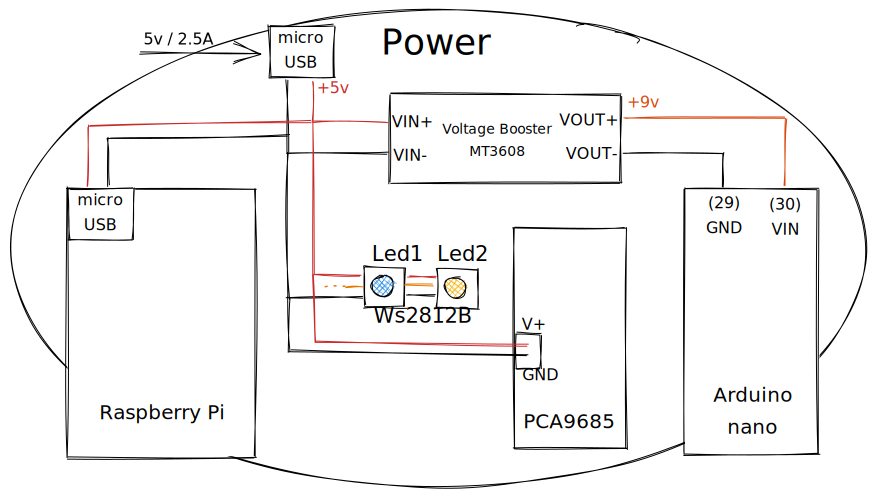

# rob_ball
My own made, reversed engineered, version of Mira, the robot made by Alonso Martinez

> Diagrams are made with opensource [excalidraw](https://excalidraw.com/)

## Intro
Rob'Ball (aka Rob' or robby for intimate persons) is a portmanteau word, composed by the word Rob like in Robot, and the word ball like a ... OK, you know what I mean.

Robby is my very own attempt in reproduce the amazing Mira robot made by Alonso Martinez, who used to work for Pixar as animator.
Alonso made Mira a couple of years ago, and I just discovered by watching a Adam Savage’s Tested video last September ( https://www.youtube.com/watch?v=0vfuOW1tsX0 ).
Mira is so cute, and technically it was very interesting to see how it works and furthermore, how it can be done.

Unfortunately, I didn't found any documentation on how to make it, but the technical pieces of informations one can get in the Tested video.

So I decided to reverse engineered it as much as I can and I made everything on my own whitout author documentation. Not only my robot should try to look as cute as Mira, but I have to make it versatile to be programmed later to accomplish some other tasks.

This robot can be made by yourself if you have access to a 3D printer, and if you have some basics in electronic and soldering.

## 3D parts
I designed Rob' using autodesk fusion360. To design the 3 axis mecanics, I got inspired by Mira robot of course, and by 'Pia the robot' from 'pohukai' on Thingiverse ( https://www.thingiverse.com/thing:2929670 )
At this stage, my mounting is not easy as I would like because it is very hard to align holes for screw mounting. I may work on a v2 to make it easier to mount and maintain.

## Architecture
The robot should be able to move it's head according to 3 axis (turn left/right, go up and down, and tilt right and left), should display it's mood with blinking eyes, moves, color lights and sounds. Last but not least, it should recognize faces and follow from look people.
Mira works on battery... what a challenge ! I decided that Rob' will be powered from external powersupply.



### Power supply
The whole robot is powered with a raspberry pi power supply (5V 2.5A).
The 5V is dispatched to power raspberry pi (through its microUSB plug), and power the PCA9685.
Arduino through Vin needs at least 6V to work properly. So I powered it with a 9v comming from a MT3608 power booster.


### Face Tracking
#### Raspberry Pi 3B+ + piCamera
Python script continuously do face tracking (single face detection). When a face is found, it computes distance and angle from the center of the camera view. Then it sends through serial communication the left/right and up/down angle to move to get the face closer to the center.
When face is lost for a couple of seconds, face tracking mode stops and send a stop face tracking signal to serial port.

### Actionners
An **arduino** nano is powered by 9 volts through Vin pin. (9 volt comes from a MT3608 power booster powered by 5V power supply.)
Arduino nano is responsible for moving the servos, driving addressable leds, and animating eyes.
#### Servo-motors
The 3 tiny LKY61 servos are driven by a PCA9685 pwm board. This board handle pwm signals and is drived by I2C communication from arduino.
#### Eyes
To make living eyes, I used 2 tiny 0.96inch OLED I2C screens. They both are driven on I2C from arduino.
#### Colors
I used two WS2812B addressable LEDs (I bought a cheap WS2812B strip led and cutted just two to have the possibility to mix the colors is needed). Those leds are driven directly by arduino.

### Communication
Raspberry Pi face tracking sends commands to arduino through serial communication (TX/RX pins, not USB as plugs takes too much space :) ). Unfortunately levels signals are not the same (3.3V for Raspberry and 5V for Arduino). So we need a level shifter which will adapt signal level for each side equipments.

## Software

### Raspberry

#### Installation

First start from the PC
1. Install Raspberry Pi OS (you can easily find howtos on internet)

1. Network configuration
   1. create wpa_supplicant.conf on the root of your raspberry pi os microSD card containing your wifi network configuration :

   ```bash
   ctrl_interface=DIR=/var/run/wpa_supplicant GROUP=netdev
    update_config=1
    country=FR

    network={
    ssid="<Name of your wireless LAN>"
    psk="<Password for your wireless LAN>"
    }
   ```

1. setup SSH : create an empty file on the root of your raspberry pi os microSD card named ```ssh``` which will activate SSH.

Now you can boot your raspberry Pi. Insert the microSD card and power the rasperry pi. Wait a couple of seconds and try to find your local ipAddress using for example your wifi router. (Find the best solution over internet tutorials). Now connect to your raspberry pi using SSH.

1. Update your raspberry pi : ```sudo apt-get update && upgrade```
1. Set up your raspberry pi config : ```sudo raspi-config```
   1. Activate Serial Port : Navigate to ```3 Interface Options > P6 Serial Port``` then select ```No``` for Login shell, and select ```yes``` fort seral Port Enabled
   1. Activate PiCamera : Navigate to ```Interface Options > P1 Camera > Enable, yes```
   1. Expand Filesystem : Navigate to ```Advanced Options > A1 Expand Filesystem```

   Now quit raspi-config tool and reboot your raspberry pi.

Install openCV for python
> /!\ this part need some re-install testing. It may be incomplete and / or innacurate
>
>These are my personnal (french sorry) notes while attempting in install openCV on my raspberry pi

~~[https://www.aranacorp.com/fr/installation-dopen-cv-sur-raspberry-pi/](https://www.aranacorp.com/fr/installation-dopen-cv-sur-raspberry-pi/)~~
(installation simple non compilée sur le pi)

inspiration : [https://www.jeremymorgan.com/tutorials/raspberry-pi/how-to-install-opencv-raspberry-pi/](https://www.jeremymorgan.com/tutorials/raspberry-pi/how-to-install-opencv-raspberry-pi/)

Mais l’installation bloquait, j’ai installé une version headless en version plus ancienne :

( https://pypi.org/project/opencv-contrib-python/ )

   Option 4 - Headless full package (contains both main modules and contrib/extra modules): (check contrib/extra modules listing from OpenCV documentation)
   ```pip install “opencv-contrib-python-headless<4.3”```

dépendances car import cv2 ne marche pas

```sudo apt-get install libilmbase-dev libopenexr-dev libgstreamer1.0-dev```
ne marche toujours pas
> Hey, this is because the latest version of openCV doesn't work with RPi. Instead of pip3 install opencv-python try ```pip3 install opencv-python==3.4.6.27```. You will need to uninstall the latest version first. ```pip3 uninstall opencv-python```

donc :

```
pip3 uninstall opencv-python
pip3 install opencv-contrib-python-headless==3.4.6.27
```

BILAN installation openCV

Début de ce tuto : https://www.jeremymorgan.com/tutorials/raspberry-pi/how-to-install-opencv-raspberry-pi/

Mais installation de opencv headless en version 3.4.6.27 (dernière version compatible avec raspi3 à cette date):
```pip3 install “opencv-contrib-python-headless==3.4.6.27”```

Tester l’installation en démarrant python en ligne de commande `python3`
puis tenter l’import d’openCV `>>> import cv2`

Installation of the python script

1. Create a new directory : `makedir roball`
1. Move to this directory : `cd roball`
1. Copy the script from github : TODO

Dependencies

1. PySerial : `sudo pip install pyserial`

**TODO** : Setup this script to run at boot

### Arduino

1. Clone the repository
1. load main.cpp file into your favorite arduino code uplaoder
1. add dependencies
1. plug your arduino and upload the code (use internet tutorials)

**TODO** complete this arduino software installation part

---

## Assembling

### 3D print

Get the stl files [TODO Link here](http://linktoupdate) and print it.

I printed it with PLA, at 0.3mm height, 0.6mm width, 0.7mm nozzle. It goes fastest, the downside is quality as layer is pretty big, and so very visible on curves

Here are some advice as it comes to my mind :

- The head main part as many details in a very thin shell. It is important you triple check your slicer settings to be sure those details could get printed correctly

- Supports : Do you like supports ? I don't ! That's why I did my best to get rim of them. Unfortunately the 2 axis mecanism have to deal with supports ! These 2 archs absolutely needs supports, so you'll have to o a good post processing to get soft sliding parts in there.

- Obviously, head and body are the parts you'll look at... 
  - head : So you may want this to be smooth as possible. Do a looong post processing by alternating paper sanding, prime painting, sanding, painting, sanding, painting.... until you get a satisfying result.
  - body : I printed mine with colorless semi-transparent PLA to let the LED's colors shine through. I did a rapid paper sanding, just to make it smooth, and to be sure it will slide properly if the head touch it while moving.

### Mounting

I used tiny Philips Flat Head self tapping M2 screws going from 4 to 12mm long.

All the 3D printing parts have holes to let the screws going through. If needed I re-drilled holes that screws in with 1.5mm drill bit, and holes that let the screw pass in, with a 2mm drill bit.

Axis for moving parts in the archs is made of nails. Just find a nail that fit correctly in the holes and cut it at length.

Head is splitted into 2 parts. Use strong glue and inner mounting screws to center everything. The joinning of those to parts may need special attention while post processing.

#### Electronics

##### Components

- Raspberry Pi B3+ with its microSD card
- Raspberry Pi official power supply (at least 5v 2.5A)
- Arduino Nano
- 3 x Servo motor LKY61
- Spy Camera [arducam](https://www.arducam.com/spy-camera-raspberry-pi/)
- 2 x OLED 0.96inch I2C
- 2 x WS2812B adressable multicolor LED
- PWM driver PCA9685
- Voltage booster MT3608 (needs to support 5Vin and at least 7Vout)
- Level Shifter 2 channels
- female micro USB plug
- male micro USB plug
- some colors wires, heatshrink tubes, Dupont wires, JST connectors

I'm not going in details into the wiring. The schematics are available in /docs/ folder of this repository, and you can use it to wire everything up. If it is not enough for you, it may be because your are not confident enough with electronic basics. Else you may ask me your questions.

Here are some thought anyway that I think may hopefully help :

- By using the MT3608 you may notice that setting the potentiomer screw does not affect the output voltage. I had this problem and found a solution that works for me : unplug th MT3608 and do 20 counter clock wise turns. Then plug the 5V IN and measure the output voltage. It should now vary when you move potentiometer screw. Set it to something between 7 and 12V to power the ardduino on Vin pin.

- You'll use 2 I2C OLED 0.96in for animating eyes. To drive them separately, you'll have to look at component and modify a resistor to change the adress (many times these OLED comes with default 0x78 but a resistor is present to enable to change the adress to 0x7A). This resistor is so small that you may need some special soldering equipment. I used a simple soldering iron, and I bet I'm lucky to not loose the tiny resistor inside a melted drop of soldering tin !
